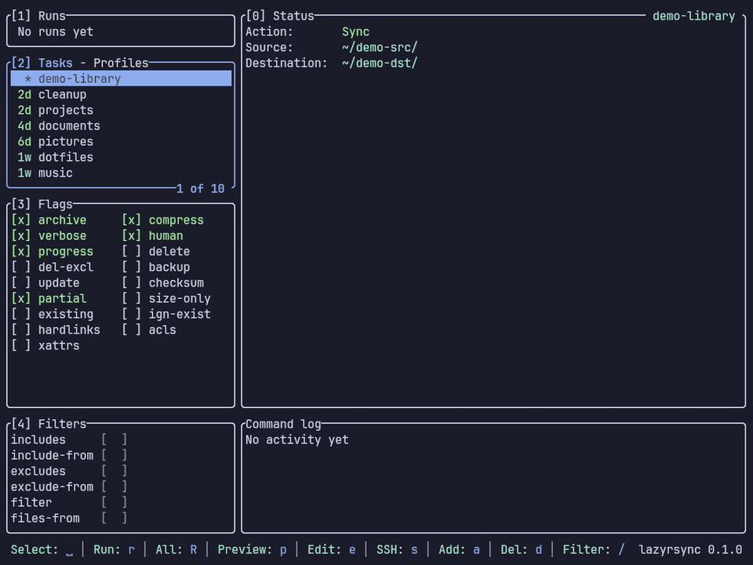
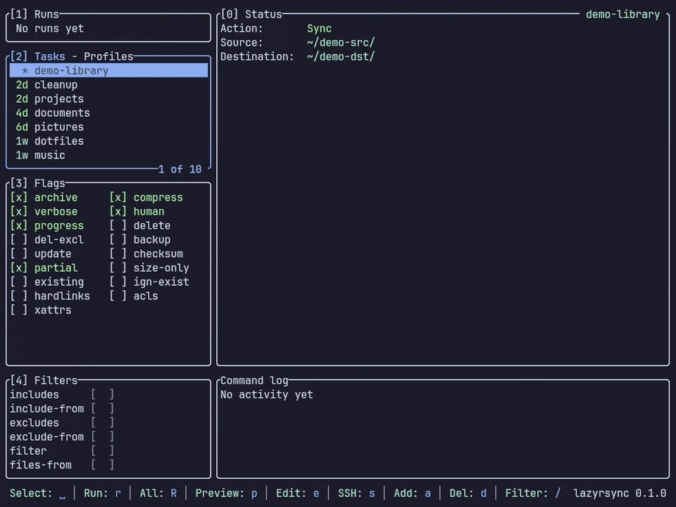
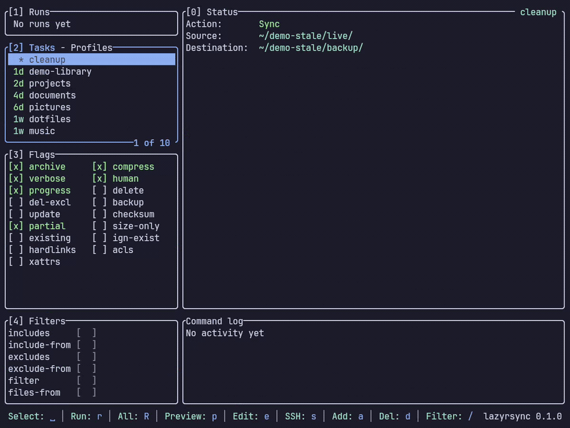
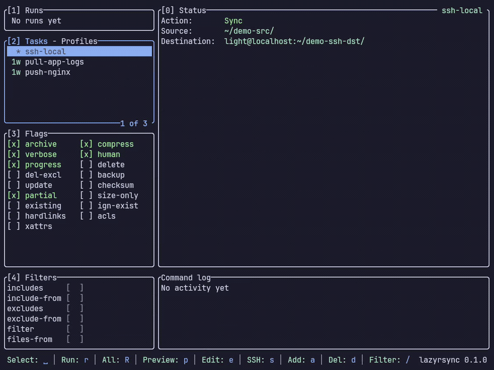
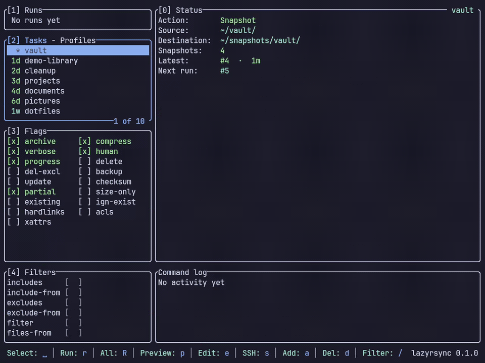

# lazyrsync

<p align="center">
  <a href="LICENSE"></a>
  <a href="https://www.rust-lang.org/"></a>
  <a href="https://ratatui.rs"></a>
  <a href="https://lazyrsync.westpoint.io"></a>
</p>

A terminal UI for `rsync` — manage reusable profiles, preview a transfer as a
structured diff **before** running it, and watch a live run with progress and
cancellation. All from the terminal, including over SSH where a desktop GUI
can't reach.

## Contents

- [Why](#why)
- [Features](#features)
- [Install](#install)
- [Quickstart](#quickstart)
- [Keybindings](#keybindings)
- [Configuration](#configuration)
- [Contributing](#contributing)
- [Acknowledgements](#acknowledgements)
- [License](#license)

## Why

`rsync` is the right tool for backups and syncs, but its flags are easy to get
wrong and a single mistake can delete data. lazyrsync keeps you in the terminal
while giving you the safety of a GUI: save your transfers once, see exactly what
a run will change before it runs, and keep destructive flags behind a gate.

## Features

### Profiles & tasks

Save a Source → Destination pair once and rerun it with a keystroke.


### Dry-run preview

Press `p` and watch the transfer resolve into a `+`/`~`/`-` diff with stats.
Nothing is written until you say so.



### Live run & cancel

`r` runs it — a progress bar fills with byte and file counts. Press `c` to
stop mid-transfer.



### Flags & `--delete` gating

Toggle rsync's options as checkboxes. Flip on `--delete` and it makes you
confirm before anything can be removed.



### Over SSH

Put a `user@host:/path` on either side of a task and it runs over SSH — remote
source downloads, remote destination uploads.



### Snapshots

Keep numbered, hardlinked versions with `--link-dest` — each run writes the
next directory (`1/`, `2/`, …).



## Install

`rsync` must be on your `$PATH`.

```bash
cargo install lazyrsync                          # crates.io
cargo binstall lazyrsync                          # prebuilt release binary
brew install westpoint-io/lazyrsync/lazyrsync     # Homebrew
yay -S lazyrsync                                   # AUR (Arch)
```

Or build from source:

```bash
cargo install --path .
```

## Quickstart

```bash
lazyrsync            # launch the TUI
```

1. Press `]` to switch to the **Profiles** sub-tab, then `a` to add a profile.
2. Back on **Tasks** (`]`), press `a` to add a task: an **ID**, an **Action**
   (Sync ⇄ Snapshot with `←/→`), a **Source**, and a **Destination**. Either
   path may be local or a remote `user@host:/path`.
3. Press `p` to **preview** (dry-run) — you'll see the exact `+`/`~`/`-`
   changes and stats, and nothing is written.
4. Press `r` to **run** it. Watch progress in the **Runs** panel; press `c` to
   cancel.

A task is just **Source → Destination**, exactly like the rsync command line —
no push/pull, no separate "remote" field. A trailing `/` on the Source copies
its _contents_; without it, the folder itself is copied.

### Resolve / inspect (headless)

lazyrsync can print the exact rsync command a profile resolves to — handy for
review or dropping into a script. Running transfers headlessly isn't wired up
yet; use the TUI to actually run them.

```bash
lazyrsync list            # list profiles and their resolved rsync commands
lazyrsync run NAME        # print the resolved command(s) for a profile
lazyrsync run NAME -n     # print the dry-run form (with -n)
```

## Keybindings

Press `?` in the app for the full, context-aware list. The essentials:

| Key | Action |
|-----|--------|
| `1`–`4`, `Tab` | Focus a rail panel (Runs / Tasks · Profiles / Flags / Filters) |
| `]` | Toggle the Tasks / Profiles sub-tab |
| `j`/`k`, `↑`/`↓` | Move the cursor |
| `space` / `enter` | Select the task (or toggle the highlighted flag) |
| `a` | Add a task (or profile, on the Profiles sub-tab) |
| `p` | Preview (dry-run) the selected task |
| `r` / `R` | Run the selected task / run every task in the profile |
| `e` / `s` / `i` / `x` | Edit Basics / SSH / Filters / Advanced |
| `d` | Delete (confirm first) |
| `V` | Visual range (multi-select), then `r`/`d` acts on the block |
| `c` | Cancel the running job |
| `/` | Filter the list, or search the run output |
| `q` / `Esc` | Quit |

## Configuration

Profiles and settings live under `$XDG_CONFIG_HOME/lazyrsync/` (typically
`~/.config/lazyrsync/`):

- `profiles.toml` — your profiles and tasks
- `settings.toml` — preferences (theme, hints, `skip_delete_warning`)

## Contributing

See [CONTRIBUTING.md](CONTRIBUTING.md) for the build/test/lint commands, the
module map, and the code + UI conventions.

## Acknowledgements

- [lazygit](https://github.com/jesseduffield/lazygit) — the TUI whose
  keyboard-driven, panel-based workflow inspired this one.
- [ratatui](https://ratatui.rs) — the Rust TUI library lazyrsync is built on.

## License

[MIT](LICENSE).
