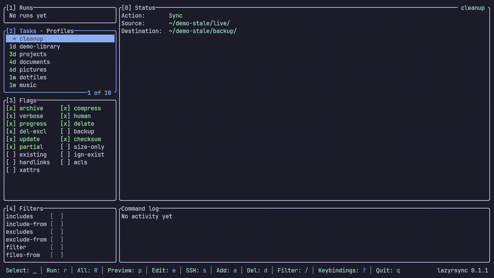

# lazyrsync

[](LICENSE)
[](https://www.rust-lang.org/)
[](https://ratatui.rs)
[](https://lazyrsync.westpoint.io)

A terminal UI for `rsync` — manage reusable profiles, preview a transfer as a
structured diff **before** running it, and watch a live run with progress and
cancellation. All from the terminal, including over SSH where a desktop GUI
can't reach.

> **Demo:** _coming soon_ — a recording will live at `assets/demo.gif`.
<!--  -->

## Contents

- [Why](#why)
- [Features](#features)
- [Install](#install)
- [Quickstart](#quickstart)
- [Keybindings](#keybindings)
- [Configuration](#configuration)
- [Contributing](#contributing)
- [Acknowledgements](#acknowledgements)
- [License](#license)

## Why

`rsync` is the right tool for backups and syncs, but its flags are easy to get
wrong and a single mistake can delete data. lazyrsync keeps you in the terminal
while giving you the safety of a GUI: save your transfers once, see exactly what
a run will change before it runs, and keep destructive flags behind a gate.

## Features

- **Profiles & tasks** — save a Source → Destination pair once, reuse it. No
  more retyping long `rsync` invocations.
- **Dry-run first** — preview every transfer as a `+`/`~`/`-` diff with stats
  before anything is written.
- **`--delete` is gated** — destructive flags are opt-in and confirmed at
  toggle-time, never the default.
- **Live runs** — a progress bar, byte/file counts, and one-key cancellation.
- **Snapshots** — optional numbered, hardlinked versions (`--link-dest`).
- **Works over SSH** — either side of a task can be a `user@host:/path`.
- **Shells out to system `rsync`** — no reimplemented protocol; your rsync,
  your flags.

## Install

Requires a Rust toolchain and `rsync` on your `$PATH`.

```bash
# install the binary from a clone
cargo install --path .

# or run straight from the source tree
cargo run --release
```

> Not yet published to a package manager — build from source for now.

## Quickstart

```bash
lazyrsync            # launch the TUI
```

1. Press `]` to switch to the **Profiles** sub-tab, then `a` to add a profile.
2. Back on **Tasks** (`]`), press `a` to add a task: an **ID**, an **Action**
   (Sync ⇄ Snapshot with `←/→`), a **Source**, and a **Destination**. Either
   path may be local or a remote `user@host:/path`.
3. Press `p` to **preview** (dry-run) — you'll see the exact `+`/`~`/`-`
   changes and stats, and nothing is written.
4. Press `r` to **run** it. Watch progress in the **Runs** panel; press `c` to
   cancel.

A task is just **Source → Destination**, exactly like the rsync command line —
no push/pull, no separate "remote" field. A trailing `/` on the Source copies
its _contents_; without it, the folder itself is copied.

### Resolve / inspect (headless)

lazyrsync can print the exact rsync command a profile resolves to — handy for
review or dropping into a script. Running transfers headlessly isn't wired up
yet; use the TUI to actually run them.

```bash
lazyrsync list            # list profiles and their resolved rsync commands
lazyrsync run NAME        # print the resolved command(s) for a profile
lazyrsync run NAME -n     # print the dry-run form (with -n)
```

## Keybindings

Press `?` in the app for the full, context-aware list. The essentials:

| Key | Action |
|-----|--------|
| `1`–`4`, `Tab` | Focus a rail panel (Runs / Tasks · Profiles / Flags / Filters) |
| `]` | Toggle the Tasks / Profiles sub-tab |
| `j`/`k`, `↑`/`↓` | Move the cursor |
| `space` / `enter` | Select the task (or toggle the highlighted flag) |
| `a` | Add a task (or profile, on the Profiles sub-tab) |
| `p` | Preview (dry-run) the selected task |
| `r` / `R` | Run the selected task / run every task in the profile |
| `e` / `s` / `i` / `x` | Edit Basics / SSH / Filters / Advanced |
| `d` | Delete (confirm first) |
| `V` | Visual range (multi-select), then `r`/`d` acts on the block |
| `c` | Cancel the running job |
| `/` | Filter the list, or search the run output |
| `q` / `Esc` | Quit |

## Configuration

Profiles and settings live under `$XDG_CONFIG_HOME/lazyrsync/` (typically
`~/.config/lazyrsync/`):

- `profiles.toml` — your profiles and tasks
- `settings.toml` — preferences (theme, hints, `skip_delete_warning`)

## Contributing

See [CONTRIBUTING.md](CONTRIBUTING.md) for the build/test/lint commands, the
module map, and the code + UI conventions.

## Acknowledgements

- [lazygit](https://github.com/jesseduffield/lazygit) — the TUI whose
  keyboard-driven, panel-based workflow inspired this one.
- [ratatui](https://ratatui.rs) — the Rust TUI library lazyrsync is built on.

## License

[MIT](LICENSE).
