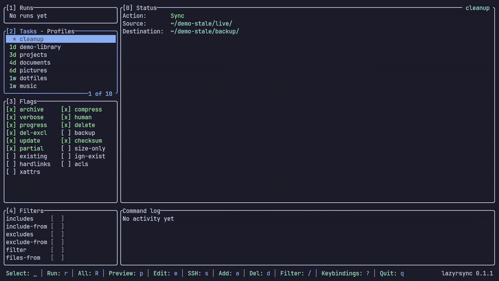
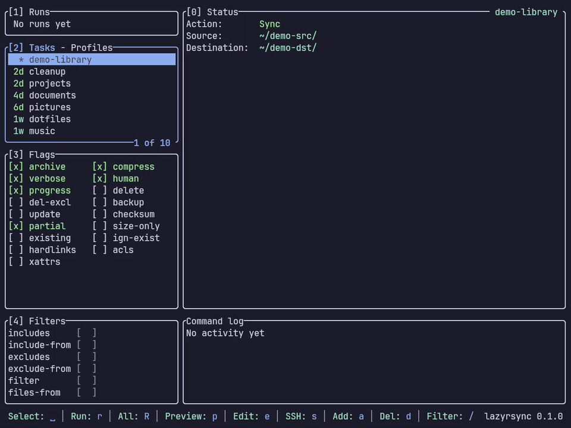
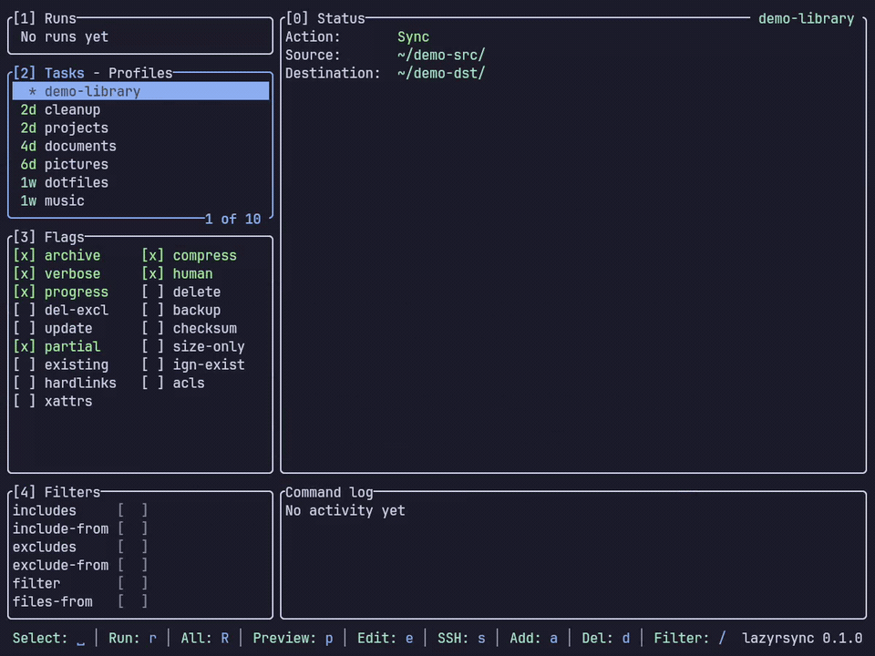
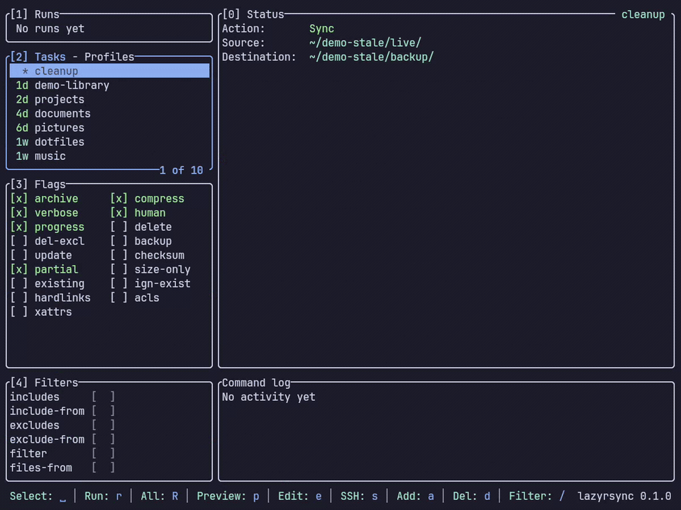
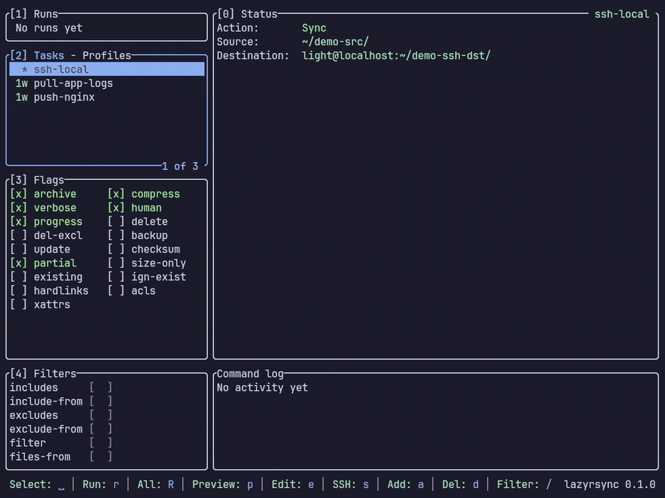
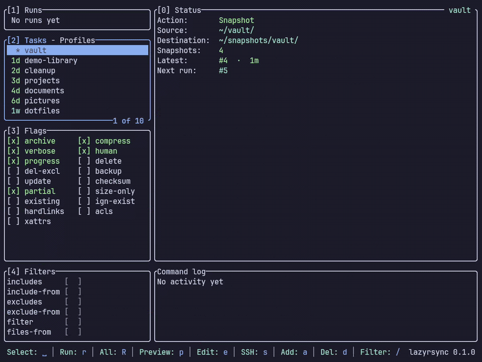

<div align="center">

  

  A terminal UI for rsync 🔄

  

  [](https://ratatui.rs)
  [](https://crates.io/crates/lazyrsync)
  [](LICENSE)
  [](https://lazyrsync.westpoint.io)

  <a title="This tool is Tool of The Week on Terminal Trove, The $HOME of all things in the terminal" href="https://terminaltrove.com/lazyrsync"></a>

</div>

A terminal UI for `rsync` — manage reusable profiles, preview a transfer as a
structured diff **before** running it, and watch a live run with progress and
cancellation. All from the terminal, including over SSH where a desktop GUI
can't reach.

## Contents

- [Why](#why)
- [Features](#features)
- [Install](#install)
- [Quickstart](#quickstart)
- [Headless & scheduling](#headless--scheduling)
- [Keybindings](#keybindings)
- [Configuration](#configuration)
- [Contributing](#contributing)
- [Acknowledgements](#acknowledgements)
- [License](#license)

## Why

`rsync` is the right tool for backups and syncs, but its flags are easy to get
wrong and a single mistake can delete data. lazyrsync keeps you in the terminal
while giving you the safety of a GUI: save your transfers once, see exactly what
a run will change before it runs, and keep destructive flags behind a gate.

## Features

### Profiles & tasks

Save a Source → Destination pair once and rerun it with a keystroke.


### Dry-run preview

Press `p` and watch the transfer resolve into a `+`/`~`/`-` diff with stats.
Nothing is written until you say so.



### Live run & cancel

`r` runs it — a progress bar fills with byte and file counts. Press `c` to
stop mid-transfer.



### Flags & `--delete` gating

Toggle rsync's options as checkboxes. Flip on `--delete` and it makes you
confirm before anything can be removed.



### Over SSH

Put a `user@host:/path` on either side of a task and it runs over SSH — remote
source downloads, remote destination uploads.



### Snapshots

Keep numbered, hardlinked versions with `--link-dest` — each run writes the
next directory (`1/`, `2/`, …).



## Install

**rsync 3.1 or later** must be on your `$PATH` — the preview needs
`--itemize-changes`, the progress bar needs `--info=progress2` (added in
3.1.0) and snapshots need `--link-dest`. The Homebrew and AUR packages pull
rsync in; `cargo install` and `cargo binstall` do not.

On macOS 15.4 and later `/usr/bin/rsync` is openrsync, which has no
`--itemize-changes` and no `--info` at all, and accepts `--link-dest` without
reliably hardlinking. `brew install rsync`, then either put it ahead of
`/usr/bin` on `$PATH` or set `rsync_path` (see
[Choosing which rsync runs](#choosing-which-rsync-runs)). lazyrsync warns at
startup when the rsync it finds is older than 3.1.

```bash
cargo install lazyrsync      # crates.io
cargo binstall lazyrsync     # prebuilt release binary
brew install lazyrsync       # Homebrew
yay -S lazyrsync             # AUR (Arch)
x eget use westpoint-io/lazyrsync  # prebuilt release binary
```

Or build from source:

```bash
cargo install --path .
```

## Quickstart

```bash
lazyrsync            # launch the TUI
```

1. Press `]` to switch to the **Profiles** sub-tab, then `a` to add a profile.
2. Back on **Tasks** (`]`), press `a` to add a task: an **ID**, an **Action**
   (Sync ⇄ Snapshot with `←/→`), a **Source**, and a **Destination**. Either
   path may be local or a remote `user@host:/path`.
3. Press `p` to **preview** (dry-run) — you'll see the exact `+`/`~`/`-`
   changes and stats, and nothing is written.
4. Press `r` to **run** it. Watch progress in the **Runs** panel; press `c` to
   cancel.

A task is just **Source → Destination**, exactly like the rsync command line —
no push/pull, no separate "remote" field. A trailing `/` on the Source copies
its _contents_; without it, the folder itself is copied.

## Headless & scheduling

Every profile you build in the TUI also runs without it, so the transfer you
verified by hand is the exact one your scheduler runs at 2am.

```bash
lazyrsync list                        # profiles, task ids, resolved rsync commands
lazyrsync run backups                 # every task in the profile
lazyrsync run backups/photos-3f2a     # a single task, by id from `list`
lazyrsync run backups -n              # real dry run, changes nothing
lazyrsync run backups --yes           # required if any task uses --delete
lazyrsync run backups -v              # add rsync's own output for each task
```

Flags compose freely — `lazyrsync run backups/photos-3f2a -n --yes` is valid.
(`list` prints the command with the TUI's `--info=progress2` flag; a headless
run drops it, since there's no progress bar to feed. A headless `-n` also drops
`--stats`, which only the TUI's preview parser reads — you get rsync's itemized
diff without the fourteen-line statistics block after every task.)

A real run passes rsync `-q`, so you get **one line per task** and nothing
else — rsync still prints its errors, which is the only chatter worth mailing.
`-v`/`--verbose` opts back into the full log per task. A dry run is **never**
quiet: the itemized diff is the whole point of `-n`, so `-n` shows it with or
without `-v`.

Why not just point cron at `rsync` directly? For a plain Sync you could. A
**Snapshot** you can't: the numbered destination directory and the
`--link-dest` chain are computed at run time by scanning the destination, so
the command differs on every run — `1/` links against nothing, `2/` links
against `1/`, and so on. No static crontab line can express that.
`lazyrsync run` resolves it fresh each time.

### Ordering

Tasks run in the order `lazyrsync list` shows them, which is **not** the order
they appear in `profiles.toml` — the loader sorts by recency. Check `list`
before you schedule anything that assumes an order.

A failing task doesn't stop the rest. Every task gets its turn, then you get a
summary and a non-zero exit code — so one broken source leaves less data
unprotected than aborting the batch would.

### Exit codes

| Exit | Meaning |
|------|---------|
| 0 | every task succeeded — or the profile has no tasks, which says so on stderr |
| 1 | refused: a task uses `--delete` and `--yes` was absent; nothing ran |
| 2 | no such profile or task id, or the config is missing or failed to load |
| 3 | a task couldn't be started, or was killed by a signal |
| _n_ | the first failing task's own rsync exit code |

rsync's exit 24 — source files vanished mid-transfer — counts as success.

rsync's own exit codes 1, 2 and 3 overlap these, so the status alone isn't
always conclusive; read the message. A refusal always says `nothing ran`
explicitly, and a task that never started ends its line with `exit 3`.

### Output streams

Successful task lines and the success summary go to **stdout**. Failed task
lines and the summary-when-something-failed go to **stderr**. So:

```bash
lazyrsync run backups >/dev/null
```

is completely silent when every task succeeds, and produces output only when
something needs your attention — which is what makes cron's mail-on-output
behaviour useful instead of noisy.

Each task gets one styled line: a counter, `✔`/`✗`, the task's label, and then
elapsed time if it worked or the exit code and the **task id** if it didn't —
the id being what you paste back into `lazyrsync run backups/<id>` to retry
just that one. Colour is dropped when the stream isn't a terminal, or when
`NO_COLOR` is set — cron mail and journald get plain text.

A run where one task fails looks like this:

```
[1/3] ✔ Documents  1.5s
rsync: [sender] change_dir "/mnt/camera" failed: No such file or directory (2)
rsync error: some files/attrs were not transferred (see previous errors) (code 23) at main.c(1347) [sender=3.4.3]
[2/3] ✗ Photos     exit 23  photos-3f2a
[3/3] ✔ Music      0.0s

3 tasks: 2 ok, 1 failed
```

and like this under `>/dev/null` — which is exactly what cron mails you:

```
rsync: [sender] change_dir "/mnt/camera" failed: No such file or directory (2)
rsync error: some files/attrs were not transferred (see previous errors) (code 23) at main.c(1347) [sender=3.4.3]
[2/3] ✗ Photos     exit 23  photos-3f2a
3 tasks: 2 ok, 1 failed
```

### Dry runs are never refused

`lazyrsync run backups -n` works on a profile containing `--delete` tasks
without `--yes`, because `--dry-run` changes nothing and no destination
directories are created. Preview first, then add `--yes` only to the command
you actually schedule.

The `--delete` gate reads a task's `--delete` and `--delete-excluded`
toggles. It does **not** parse the Advanced raw-args field, so a `--delete`
written by hand there gets past the gate — the same caveat the TUI carries.

### crontab

```cron
30 2 * * * /usr/bin/lazyrsync run backups >/dev/null
```

Add `--yes` only if the profile contains a `--delete` task.

### systemd timer

Prefer this over cron: `Persistent=true` catches up a run missed while the
machine was off, and journald keeps the output.

```ini
# ~/.config/systemd/user/lazyrsync-backups.service
[Service]
Type=oneshot
ExecStart=/usr/bin/lazyrsync run backups

# ~/.config/systemd/user/lazyrsync-backups.timer
[Timer]
OnCalendar=daily
Persistent=true

[Install]
WantedBy=timers.target
```

```bash
systemctl --user enable --now lazyrsync-backups.timer
journalctl --user -u lazyrsync-backups        # what the last run did
```

### Per-task schedules

Because a task has its own address, each one can run on its own clock:

```cron
0 * * * *  /usr/bin/lazyrsync run backups/docs-a91c >/dev/null
30 2 * * 0 /usr/bin/lazyrsync run backups/photos-3f2a >/dev/null
```

### Three things that break scheduled runs

- **Use the absolute path.** cron's `PATH` is minimal and won't find a binary
  in `~/.cargo/bin`. `command -v lazyrsync` tells you what to write.
- **SSH keys must be passwordless.** Remote tasks run under
  `ssh -o BatchMode=yes`, so ssh fails fast instead of hanging on a prompt —
  but there's no ssh-agent under cron. Use a passwordless key, or set the
  task's SSH key file.
- **Don't expect a scheduled run to tell you what moved.** It prints one line
  per task and nothing else, so the exit code is the signal, and cron mails you
  on failure by itself. Add `-v` when you rerun by hand to debug.

Dated destinations need no extra flags — path fields expand `{now:%Y-%m-%d}`,
`{utcnow:…}`, `{hostname}`, `{user}`, `$VAR` and `~` on every run, headless
included. See [Dynamic paths](#dynamic-paths).

## Keybindings

Press `?` in the app for the full, context-aware list. The essentials:

| Key | Action |
|-----|--------|
| `1`–`4`, `Tab` | Focus a rail panel (Runs / Tasks · Profiles / Flags / Filters) |
| `]` | Toggle the Tasks / Profiles sub-tab |
| `j`/`k`, `↑`/`↓` | Move the cursor |
| `space` / `enter` | Select the task (or toggle the highlighted flag) |
| `a` | Add a task (or profile, on the Profiles sub-tab) |
| `p` | Preview (dry-run) the selected task |
| `r` / `R` | Run the selected task / run every task in the profile |
| `e` / `s` / `i` / `x` | Edit Basics / SSH / Filters / Advanced |
| `d` | Delete (confirm first) |
| `V` | Visual range (multi-select), then `r`/`d` acts on the block |
| `c` | Cancel the running job |
| `/` | Filter the list, or search the run output |
| `q` / `Esc` | Quit |

## Configuration

Profiles and settings live under `$XDG_CONFIG_HOME/lazyrsync/` (typically
`~/.config/lazyrsync/`):

- `profiles.toml` — your profiles and tasks
- `settings.toml` — preferences (theme, hints, confirmation prompts)

If `XDG_CONFIG_HOME` is unset, the path falls back to
`~/.config/lazyrsync/profiles.toml`.

### `profiles.toml`

The TUI writes this file for you, but it is a supported hand-editable format —
useful for provisioning with Ansible or a dotfiles repo alongside
[headless runs](#headless--scheduling). Every key below is shown with its
default:

```toml
[[profile]]
name = "backups"                 # required
description = "nightly"          # ""

[[profile.task]]
label  = "photos"                # required
source = "/home/me/Pictures/"    # required
dest   = "/mnt/nas/pics/{now:%Y-%m-%d}/"
id     = "photos-3f2a"           # auto-generated from label + source/dest
action = "sync"                  # sync | snapshot

[profile.task.flags]
archive = true
compress = true
verbose = true
human = true
progress = true
partial = true
delete = false                   # destructive — mirrors deletions to dest
delete_excluded = false          # destructive — deletes excluded files at dest
backup = false
update = false
checksum = false
size_only = false
existing = false
ignore_existing = false
bwlimit_kbps = 0                 # 0 = unlimited
hardlinks = false
acls = false
xattrs = false

[profile.task.filters]
excludes = []
includes = []
exclude_from = ""
include_from = ""
files_from = ""
filter = []

[profile.task.ssh]
port = 22
keyfile = ""
extra = ""

[profile.task.advanced]
raw_args = ""
```

A profile holds one or more tasks; every section except `[[profile]]`,
`label` and `source` may be omitted. lazyrsync also writes `created` and
`last_files` bookkeeping keys, which you can leave out.

`source` and `dest` accept the placeholders described under
[Dynamic paths](#dynamic-paths) — `{now:%Y-%m-%d}`, `{utcnow:…}`,
`{hostname}`, `{user}`, `$VAR`, `${VAR}` and `~` — resolved on every run.

With `action = "snapshot"`, `dest` is the parent directory: lazyrsync picks the
next numbered subdirectory and builds the `--link-dest` chain to the previous
one at run time, so each run keeps a hardlinked version. See
[Snapshots](#snapshots).

**Unknown keys are an error, not a warning.** A misspelled key would otherwise
be dropped in silence and its default used in place — for `excludes` that means
running with no exclusions at all, which on a `delete = true` task mirrors away
everything you meant to skip. lazyrsync instead refuses to load the file and
names the offending key:

```console
$ lazyrsync run backups
error: parsing /home/me/.config/lazyrsync/profiles.toml: TOML parse error at line 13, column 1
   |
13 | exclude = ["node_modules/"]
   | ^^^^^^^
unknown field `exclude`, expected one of `excludes`, `includes`, `exclude_from`, `include_from`, `files_from`, `filter`
```

`settings.toml` is parsed under the same rule. One consequence for both: a file
written by a newer lazyrsync may fail to load on an older binary rather than
being partially ignored.

### Confirmation prompts

Every prompt has its own opt-out in `settings.toml`, all `false` by default:

| Key | Silences |
|-----|----------|
| `skip_delete_warning` | the alert shown when you enable a task's `delete` flag |
| `skip_run_confirm` | the confirmation shown before a run starts |
| `skip_remove_confirm` | the confirmation shown before removing a profile or task |

`skip_run_confirm` removes the last prompt before a transfer, including for
tasks that use `--delete`.

### Choosing which rsync runs

By default lazyrsync runs the first `rsync` on your `$PATH`. Point
`rsync_path` in `settings.toml` at a specific binary to override that:

```toml
rsync_path = "/opt/homebrew/bin/rsync"
```

Useful on macOS 15.4+, where `/usr/bin/rsync` is openrsync and comes ahead of
Homebrew's rsync on `$PATH` — and in any launch context with a minimal
`$PATH`, such as cron. The configured binary is what the resolved command
shown in the TUI and `lazyrsync list` reports.

### Dynamic paths

Source and destination paths can contain placeholders, resolved every time the
task runs — so one saved task can write to a new dated folder each night:

| Placeholder | Expands to |
|-------------|------------|
| `{now}` | today's date, `2026-07-27` |
| `{now:FORMAT}` | any [strftime](https://docs.rs/chrono/latest/chrono/format/strftime/index.html) format, e.g. `{now:%Y/%m/%d}` or `{now:%H%M}` |
| `{utcnow}`, `{utcnow:FORMAT}` | the same in UTC |
| `{hostname}` | this machine's hostname |
| `{user}` | the current user |
| `$VAR`, `${VAR}` | an environment variable |
| `~` | your home directory |

```toml
dest = "~/backups/{hostname}/{now:%Y-%m-%d}/"
```

Unknown placeholders, unset variables and a bare `%` are left exactly as typed,
and the dry-run preview always shows the resolved path before anything runs.
Braces and `$` are escaped by doubling them — `{{now}}` is a folder literally
named `{now}`, and `$$HOME` a folder named `$HOME`.

## Contributing

See [CONTRIBUTING.md](CONTRIBUTING.md) for the build/test/lint commands, the
module map, and the code + UI conventions.

## Acknowledgements

- [lazygit](https://github.com/jesseduffield/lazygit) — the TUI whose
  keyboard-driven, panel-based workflow inspired this one.
- [ratatui](https://ratatui.rs) — the Rust TUI library lazyrsync is built on.

## License

[MIT](LICENSE).
